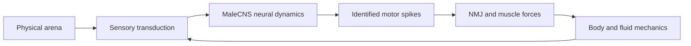

# Architecture

The same `Session` drives interactive and finite-history execution. There is no
second simulation engine hidden in the viewer or experiment runner.

| Owner | Responsibility |
|---|---|
| `runtime/prepare_cns.py` | Select classified/traced neurons, retain released positive contact counts and explicit transmitter uncertainty |
| `runtime/cns.py` | CUDA neural state; Eon LIF plus estimated graded visual compartments; no action selector |
| `runtime/cns_live.py` | Causal neural/physical scheduling, state validation, worker protocol and checkpoint commands |
| `runtime/cns_body.py` | Exact target/side joins, separate NMJs, shared muscle capacity and body assembly |
| `runtime/cns_senses.py` | Physical observations to supported sensory IDs |
| `runtime/*_muscles.py`, `flight_*.py` | Constitutive mechanics, activation, contacts and primed fluid coupling |
| `runtime/checkpoint.py` | Atomic JSON/NumPy state storage without executable pickle |
| `runtime/experiment.py` | Explicit source histories and isolated individual state |
| `runtime/transport.py` | JSON-line subprocess client, identity checks, response deadlines and EOF cleanup |
| `runtime/viewer.py` | Optional Cocoa/MuJoCo native UI; rendering does not decide actions |

## Time and state

One neural interval is 100 microseconds and contains 40 physical/NMJ/fluid steps
of 2.5 microseconds. A newly computed neural event is queued at the end of its
interval and affects later force intervals. Source observations feed the next
neural step. Display packet size does not choose neural or physical timesteps.

Most CNS cells use a lumped integrate-and-fire approximation with fixed
synapse-count weights. Photoreceptor/L1/L2 compartments use estimated graded
dynamics. Unknown transmitter contributions remain zero in the fast-current
approximation while their structural edges are retained. This is incomplete
physiology, not evidence that those biological pathways are inactive.

The public sensory map is generated from pinned MaleCNS annotations and licensed
optical data. Restricted source tables and a separate historical FlyWire crosswalk
are not embedded. [Mapping provenance](../data/sensory-map-provenance.json)
records the selection, attribution, preserved ordering and hash identities.

## Worker interface

`./fly backend` launches a local CUDA process that reads JSON lines from standard
input and writes JSON lines to standard output. It starts a fresh individual.
Closing standard input ends the worker. Diagnostic text goes to standard error.
Use `./fly experiment` for a finite declared history and retained results.

The first response declares protocol version 6, source/body/sensory identities,
dimensions and supported coverage. Commands contain `paused`, `reset`, physical
`sources`, optional `steps` from 1 to 100, and an explicit `release_block`
intervention. A source is a physical object configuration, not a direct motor input.

Named checkpoint commands are `{"checkpoint":"save","name":"example"}`
and `{"checkpoint":"restore","name":"example"}`. Names are validated;
checkpoints are stored in ignored `runtime/individuals/`. Restore validates the
complete source, data, runtime, schema and state identities before mutation.

Pause, trial transition, full reset and restore have distinct semantics. New
learned/structural mechanisms must extend the explicit state contract. Existing
voltage, adaptation and NMJ history do not establish learned memory.

The client defaults to the local interpreter and runtime files. An explicitly
supplied compatible worker command is tokenized without shell evaluation; it is
never inferred from a saved machine name or account. Identity checks remain strict.
