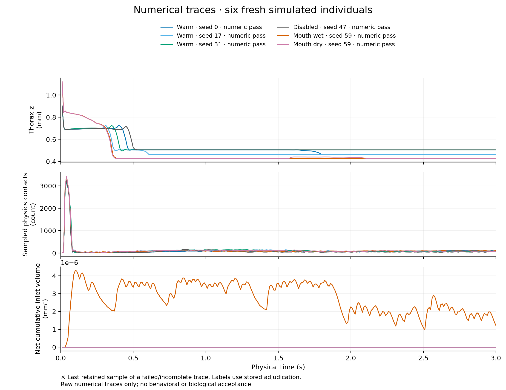

# Selected results and evidence limits

These are public scientific summaries of completed studies. They are not new
executions of this reorganized source tree. Personal paths, environment records,
individual checkpoints and operational resource logs are excluded. Source and
data references are preserved in the research reports and reference index.

| Artifact | Established scope | Does not establish |
|---|---|---|
| [Numerical campaign](numerical-campaign.json) | Six 3-second histories plus 0.1-second pilot; finite state, clocks and fluid conservation | Biological fidelity, global convergence, normal repertoire or learning |
| [Persistence](persistence.json) | Exact current-state continuation and specified fault/isolation checks | Learned memory or compatibility with a changed source/layout |
| [Performance](performance.json) | Bounded 7.687→6.420 s compute comparison; observed 14 native updates/s | Real-time physical simulation or a new-platform benchmark |
| [Huang/Luo](research/huang.json) | Original reduced-model source reproduction | Integrated MaleCNS plasticity or held-out learning behavior |
| [Odor composition](research/odor-composition.json) | Recorded source-law composition and retained spike events | A biological error score or live sensory integration |
| [Calibration](research/calibration.json) | Instrument/material and equation comparisons | Living whole-body force calibration |
| [Electrical reference](research/electrical-reference.json) | Bounded predictions for two recorded preparations | Population equivalence or native cell-physiology transfer |
| [Photoreceptor sources](research/photoreceptor-source.json) | Recorded/released array and source checks | Executed photon-to-voltage model reproduction |

The plot is descriptive. Thorax descent is not walking, signed inlet volume is
not gross food consumption, and sequential checkpoint phases are not biological
replicates. Samples do not bound every physical substep. See
[status](../docs/status.md), [testing](../docs/testing.md), and the
[research report index](../docs/research/README.md).

Historic report references to an original receipt or source artifact identify
the record used for that study. Not every original artifact is redistributed:
large sources use explicit acquisition recipes; restricted tables and private
operational archives are omitted. New experiments must use fresh `runs/` paths
and their actual current source/data identities.
